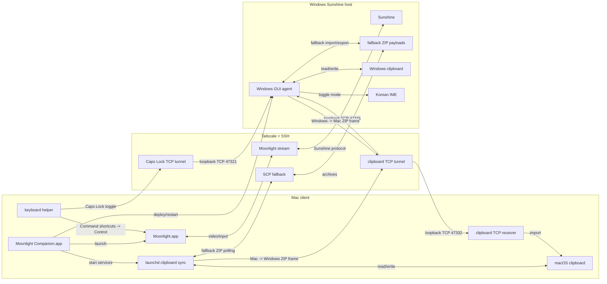

# Moonlight Companion

Moonlight Companion is a wrapper around Moonlight for Mac clients connecting to Windows Sunshine hosts. It launches Moonlight and runs a sidecar clipboard bridge over SSH/Tailscale.

The bridge is designed for remote GUI work where Moonlight provides excellent video latency but does not behave like a full remote desktop clipboard.

## Version

Current version: `v0.2.0`

## Features

- Launches Moonlight with a configurable profile.
- Builds a native macOS wrapper app bundle.
- Starts a macOS `launchd` clipboard sync agent.
- Deploys a Windows clipboard agent over SSH.
- Syncs clipboard payloads over persistent loopback TCP channels forwarded by SSH, with ZIP file polling as fallback.
- Supports text, images, and file/folder clipboard payloads.
- Maps Caps Lock to the Windows Korean IME Han/Eng toggle while the Windows agent is running.
- Maps Mac-style Command shortcuts to Windows-style Control shortcuts while Moonlight is focused.
- Uses SSH over Tailscale; no public port forwarding is required.

## Current Assumptions

- Mac client, Windows Sunshine host.
- Passwordless SSH from Mac to Windows is already configured.
- Moonlight is installed at `/Applications/Moonlight.app`.
- The Windows agent runs inside the logged-in Windows GUI session. It is installed into the user's Startup folder.
- Caps Lock Han/Eng switching requires the Windows Korean IME to be installed and active.
- Caps Lock Han/Eng switching uses a macOS event monitor while Moonlight is focused. macOS may require Accessibility permission for the helper.

## Daily Use

Build the wrapper app:

```bash
scripts/build-mac-app.sh
```

Run it from the build output:

```bash
open "dist/Moonlight Companion.app"
```

Or install it into `/Applications`:

```bash
rm -rf "/Applications/Moonlight Companion.app"
ditto "dist/Moonlight Companion.app" "/Applications/Moonlight Companion.app"
open "/Applications/Moonlight Companion.app"
```

When the app opens, adjust the settings and click `Start Moonlight`. The app then:

1. Verifies SSH access to the Windows host.
2. Deploys or updates the Windows clipboard agent.
3. Starts the macOS clipboard sync and Moonlight keyboard agents.
4. Launches Moonlight with the configured stream settings.

The GUI writes user settings to `~/Library/Application Support/MoonlightCompanion/moonlight-companion.conf`.

Inside the Moonlight session, use Windows shortcuts:

- Copy inside Windows/Moonlight: `Cmd+C`
- Paste inside Windows/Moonlight: `Cmd+V`
- Cut inside Windows/Moonlight: `Cmd+X`
- Undo inside Windows/Moonlight: `Cmd+Z`
- Toggle Korean/English input in Windows: `Caps Lock`

When Moonlight is focused, the macOS keyboard helper intercepts Caps Lock and sends a tiny command over a persistent local TCP connection. That local connection is forwarded over SSH to a loopback-only listener in the Windows GUI agent, which toggles the active Korean IME conversion mode in the logged-in desktop session.

The same helper remaps Mac-style Command shortcuts to Windows-style Control shortcuts while Moonlight is focused. That means common shortcuts such as `Cmd+C`, `Cmd+V`, `Cmd+X`, `Cmd+Z`, `Cmd+A`, `Cmd+S`, `Cmd+F`, and `Cmd+W` are delivered to Windows as their `Ctrl` equivalents.

Clipboard sync uses the same shape of transport: Moonlight Companion keeps separate TCP channels open for Mac-to-Windows and Windows-to-Mac clipboard payloads. Payloads are still encoded as ZIP archives for text, images, and file drops, and the older shared ZIP polling path remains available as a fallback.

## Zero-Base Setup

These steps assume a fresh Mac client and a fresh Windows Sunshine host.

### 1. Prepare The Windows Host

Install and configure:

- Tailscale, logged into the same tailnet as the Mac.
- Sunshine, configured to stream the Windows desktop.
- OpenSSH Server for Windows.

Enable SSH from an elevated PowerShell window:

```powershell
Add-WindowsCapability -Online -Name OpenSSH.Server~~~~0.0.1.0
Set-Service sshd -StartupType Automatic
Start-Service sshd
```

Get the Windows Tailscale IP:

```powershell
tailscale ip -4
```

Keep the Windows user logged into the GUI desktop. The clipboard agent must run in the interactive desktop session, not only in a service session.

### 2. Prepare The Mac Client

Install and configure:

- Tailscale, logged into the same tailnet as the Windows host.
- Moonlight at `/Applications/Moonlight.app`.
- Xcode Command Line Tools for `swiftc`.

Install Xcode Command Line Tools if needed:

```bash
xcode-select --install
```

Generate a dedicated SSH key:

```bash
ssh-keygen -t ed25519 -f ~/.ssh/id_ed25519_moonlight_windows -C "moonlight-companion"
```

Add the public key to the Windows user's SSH authorized keys:

```bash
pbcopy < ~/.ssh/id_ed25519_moonlight_windows.pub
```

On Windows, paste that public key into:

```text
%USERPROFILE%\.ssh\authorized_keys
```

Create or update the Mac SSH config:

```sshconfig
Host moonlight-windows
  HostName 100.x.y.z
  User windows-user
  IdentityFile ~/.ssh/id_ed25519_moonlight_windows
  IdentitiesOnly yes
  StrictHostKeyChecking accept-new
```

Test passwordless SSH:

```bash
ssh moonlight-windows "cmd.exe /c echo ssh-ok"
```

### 3. Configure Moonlight Companion

1. Copy `config/moonlight-companion.conf.example` to `config/moonlight-companion.conf`.
2. Edit `MOONLIGHT_HOST`, `WINDOWS_SSH`, resolution, bitrate, and display mode.

Example:

```bash
cp config/moonlight-companion.conf.example config/moonlight-companion.conf
```

```bash
WINDOWS_SSH="moonlight-windows"
MOONLIGHT_HOST="100.x.y.z"
MOONLIGHT_STREAM_APP="Desktop"
MOONLIGHT_RESOLUTION="3456x2234"
MOONLIGHT_FPS="60"
MOONLIGHT_BITRATE="60000"
MOONLIGHT_DISPLAY_MODE="windowed"
MOONLIGHT_VIDEO_CODEC="HEVC"
MOONLIGHT_CAPSLOCK_HANGUL="yes"
MOONLIGHT_SHORTCUT_REMAP="yes"
MOONLIGHT_CLIPBOARD_TCP="yes"
```

Build the wrapper app:

```bash
scripts/build-mac-app.sh
```

Open it:

```bash
open "dist/Moonlight Companion.app"
```

The app bundle includes the Mac scripts, Windows agent scripts, and config files needed by the launcher. If `config/moonlight-companion.conf` exists when the app is built, it is copied into the local `dist/` app bundle.

## Release Packaging

Create a public release ZIP and checksum:

```bash
scripts/package-release.sh
```

This writes:

```text
dist/release/Moonlight-Companion-v0.2.0.zip
dist/release/Moonlight-Companion-v0.2.0.zip.sha256
```

Release packages intentionally include only `config/moonlight-companion.conf.example`. The ignored local config file is skipped so private hostnames, Tailscale IPs, usernames, and stream settings stay out of public artifacts.

## Architecture



See [docs/architecture.md](docs/architecture.md) for the full runtime and clipboard sync diagrams.

## Release History

Release notes are tracked in [CHANGELOG.md](CHANGELOG.md) and mirrored to [GitHub Releases](https://github.com/Lunamana00/moonlight-companion/releases).

## Notes

The clipboard bridge stores transient payloads under:

- macOS: `~/Library/Application Support/MoonlightClipboardSync`
- Windows: `%USERPROFILE%\.moonlight-clipboard-sync`

The default payload limit is 50 MiB. This is intentional; very large file clipboard payloads are better moved with a file sync tool.

If Caps Lock Han/Eng switching does not respond, check:

```bash
mac/status-moonlight-clipboard-sync.sh
```

Then grant Accessibility permission to the keyboard helper if macOS reports that the event tap cannot be created.
