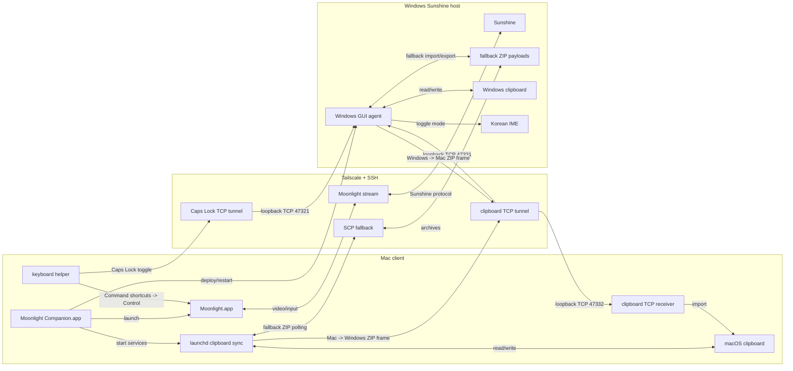

# Moonlight Companion

Moonlight Companion is a wrapper around Moonlight for Mac clients connecting to Windows Sunshine hosts. It launches Moonlight and runs a sidecar clipboard bridge over SSH/Tailscale.

The bridge is designed for remote GUI work where Moonlight provides excellent video latency but does not behave like a full remote desktop clipboard.

## Version

Current version: `v0.3.0`

## Features

- Launches Moonlight with a configurable profile.
- Provides a GUI for editing launch settings, starting/stopping Moonlight, and selecting the launch display.
- Builds a native macOS wrapper app bundle.
- Starts a macOS `launchd` clipboard sync agent.
- Deploys a Windows clipboard agent over SSH.
- Syncs clipboard payloads over persistent loopback TCP channels forwarded by SSH, with ZIP file polling as fallback.
- Supports text, images, and file/folder clipboard payloads.
- Lets you drop Mac files/folders onto the Moonlight window to send them to Windows.
- Copies received file payloads into durable transfer folders on both Mac and Windows, with Mac notifications and optional Finder reveal for file transfer events.
- Provides a GUI file transfer test for checking both Mac-to-Windows and Windows-to-Mac paths.
- Maps Caps Lock to the Windows Korean IME Han/Eng toggle while the Windows agent is running.
- Maps Mac-style Command shortcuts to Windows-style Control shortcuts while Moonlight is focused.
- Uses SSH over Tailscale; no public port forwarding is required.

## Current Assumptions

- Mac client, Windows Sunshine host.
- Passwordless SSH from Mac to Windows is already configured.
- Moonlight is installed at `/Applications/Moonlight.app`.
- The Windows agent runs inside the logged-in Windows GUI session. It is installed into the user's Startup folder.
- Caps Lock Han/Eng switching requires the Windows Korean IME to be installed and active.
- Caps Lock Han/Eng switching uses a macOS event monitor while Moonlight is focused. macOS may require Accessibility permission for the helper.

## Daily Use

Build the wrapper app:

```bash
scripts/build-mac-app.sh
```

Run it from the build output:

```bash
open "dist/Moonlight Companion.app"
```

Or install it into `/Applications`:

```bash
rm -rf "/Applications/Moonlight Companion.app"
ditto "dist/Moonlight Companion.app" "/Applications/Moonlight Companion.app"
open "/Applications/Moonlight Companion.app"
```

When the app opens, adjust the settings and click `Start Moonlight`. The app then:

1. Verifies SSH access to the Windows host.
2. Deploys or updates the Windows clipboard agent.
3. Starts the macOS clipboard sync and Moonlight keyboard agents.
4. Launches Moonlight with the configured stream settings.

The GUI writes user settings to `~/Library/Application Support/MoonlightCompanion/moonlight-companion.conf`. Use `Stop Moonlight` to quit the Moonlight stream without stopping the clipboard and keyboard sidecars. Use `Launch Display` to choose the Mac display where Moonlight should be placed after launch. Existing user settings migrate to hide the Companion control window on launch so background work does not interrupt the current Mac workspace; click the Dock icon or enable `Show Companion window on launch` when you want the panel to appear automatically. By default neither the Companion window nor the Moonlight launch/placement helper forces itself to the foreground; enable `Bring Companion window forward on launch` or `Bring Moonlight forward after launch` if you prefer the old foreground behavior.

Inside the Moonlight session, use Windows shortcuts:

- Copy inside Windows/Moonlight: `Cmd+C`
- Paste inside Windows/Moonlight: `Cmd+V`
- Cut inside Windows/Moonlight: `Cmd+X`
- Undo inside Windows/Moonlight: `Cmd+Z`
- Toggle Korean/English input in Windows: `Caps Lock`

When Moonlight is focused, the macOS keyboard helper intercepts Caps Lock and sends a tiny command over a persistent local TCP connection. That local connection is forwarded over SSH to a loopback-only listener in the Windows GUI agent, which toggles the active Korean IME conversion mode in the logged-in desktop session.

The same helper remaps Mac-style Command shortcuts to Windows-style Control shortcuts while Moonlight is focused. That means common shortcuts such as `Cmd+C`, `Cmd+V`, `Cmd+X`, `Cmd+Z`, `Cmd+A`, `Cmd+S`, `Cmd+F`, and `Cmd+W` are delivered to Windows as their `Ctrl` equivalents.

Clipboard sync uses the same shape of transport: Moonlight Companion keeps separate TCP channels open for Mac-to-Windows and Windows-to-Mac clipboard payloads. Payloads are still encoded as ZIP archives for text, images, and file drops, and the older shared ZIP polling path remains available as a fallback.

For direct file transfer from Mac to Windows, drag files or folders from Finder toward the Moonlight window. Companion detects the file drag near Moonlight, including fast pointer paths that cross the Moonlight frame, then briefly latches that hit and magnetically keeps the whole Moonlight window as a drop target for that drag. The drop target accepts modern file URL drag items plus Finder filename pasteboard entries. The Companion window also keeps a fallback drop target and a small floating drop strip. While sending, Companion shows the dropped item names, total source size, and live phases for metadata collection, packaging, TCP/SSH send, and Windows receive confirmation. If another transfer, reveal, or transfer test is already running, new file drops are queued and sent after the current operation finishes successfully; cancelling or failing the busy operation clears those queued drops. Files within the clipboard payload limit are sent over the existing Mac-to-Windows clipboard TCP channel, imported into the Windows clipboard as file drops, and copied into the configured Windows receive folder. Oversized drops can instead be copied directly into the Windows receive folder over SSH, so large files still arrive even though they are not placed on the Windows clipboard and cannot be auto-pasted. Current Windows agents acknowledge clipboard imports on the same TCP connection, so Companion can quickly show that the receive-folder import was confirmed, including the actual Windows receive-folder names; otherwise it falls back to the older SSH state check and clearly marks confirmation as pending if no confirmation arrives. Moonlight window and strip drops wait longer for fallback confirmation when automatic paste or reveal is enabled, then send `Ctrl+V` only after Windows confirms the import and the Windows clipboard is ready so the files land in the focused Windows app; if confirmation is still pending or the transfer used direct receive-folder copy, Companion leaves the files for manual use instead of risking a stale paste, then notifies macOS with the result. The GUI can also ask Windows to reveal the latest confirmed received item again if Explorer was hidden or automatic reveal is disabled.

For Windows to Mac transfer, copy files in Windows Explorer. The Windows agent exports that file clipboard payload over the Windows-to-Mac TCP channel when it fits the clipboard payload limit, and current Mac receivers acknowledge the import before the Windows agent treats TCP delivery as complete. Oversized file copies can still be exposed as the existing SSH fallback ZIP, and failed or unacknowledged TCP sends keep that fallback available, so the Mac sync agent pulls files into the configured Mac receive folder even when they are too large for the live TCP clipboard channel or TCP confirmation is unavailable. The Mac receiver places received files on the macOS clipboard, records the latest received Mac file paths, and notifies macOS with the received file names and total size so you can paste into Finder. When `MOONLIGHT_TRANSFER_REVEAL_MAC_DIR` is enabled, Finder reveals the newly received files directly instead of only opening the receive folder. If Companion is open, its status line also updates when new Mac files arrive; receives that arrive while another GUI operation is busy are shown after that operation finishes. The GUI can reveal the last received Mac files again if the notification was missed or Finder moved behind other windows, or copy the latest received files back onto the Mac clipboard if another clipboard action replaced them before you pasted. That clipboard restore also refreshes the local sync state so it does not get mirrored back to Windows as a new send.

Receive folders never overwrite an existing file with the same name. Repeated same-name transfers use suffixes such as `-2` before the extension.

Files received from Windows are marked as the current Mac clipboard state, so the background sync does not immediately echo them back to Windows.

If the TCP channel is unavailable, the fallback polling path keeps the same receive-folder import and file-detail notifications.

The default setting keeps Finder reveal off so received Windows files do not interrupt your current Mac workspace. Use `Reveal Last Mac Receive` or enable `MOONLIGHT_TRANSFER_REVEAL_MAC_DIR` when you want Finder to jump to new files automatically.

Use `Test File Transfer` in the GUI to refresh the Windows agent, start the Mac transfer services, stream the current test step into the status line, create small temporary and empty files, PNG image files, Korean file names, Windows-safe Mac file and folder name conversion, file names with spaces and apostrophes, multi-item selections, nested folders, and empty subfolders, verify both directions, confirm the Mac-to-Windows receive-folder import, check same-name collision handling, and clean up the test payloads without opening Terminal. Supported Mac clipboard contents are restored after the test, including file clipboards that point at original local paths; while the test runs, background Mac-to-Windows clipboard polling is paused so test clipboard mutations and the final restore are not mirrored as ordinary user clipboard changes.

## Zero-Base Setup

These steps assume a fresh Mac client and a fresh Windows Sunshine host.

### 1. Prepare The Windows Host

Install and configure:

- Tailscale, logged into the same tailnet as the Mac.
- Sunshine, configured to stream the Windows desktop.
- OpenSSH Server for Windows.

Enable SSH from an elevated PowerShell window:

```powershell
Add-WindowsCapability -Online -Name OpenSSH.Server~~~~0.0.1.0
Set-Service sshd -StartupType Automatic
Start-Service sshd
```

Get the Windows Tailscale IP:

```powershell
tailscale ip -4
```

Keep the Windows user logged into the GUI desktop. The clipboard agent must run in the interactive desktop session, not only in a service session.

### 2. Prepare The Mac Client

Install and configure:

- Tailscale, logged into the same tailnet as the Windows host.
- Moonlight at `/Applications/Moonlight.app`.
- Xcode Command Line Tools for `swiftc`.

Install Xcode Command Line Tools if needed:

```bash
xcode-select --install
```

Generate a dedicated SSH key:

```bash
ssh-keygen -t ed25519 -f ~/.ssh/id_ed25519_moonlight_windows -C "moonlight-companion"
```

Add the public key to the Windows user's SSH authorized keys:

```bash
pbcopy < ~/.ssh/id_ed25519_moonlight_windows.pub
```

On Windows, paste that public key into:

```text
%USERPROFILE%\.ssh\authorized_keys
```

Create or update the Mac SSH config:

```sshconfig
Host moonlight-windows
  HostName 100.x.y.z
  User windows-user
  IdentityFile ~/.ssh/id_ed25519_moonlight_windows
  IdentitiesOnly yes
  StrictHostKeyChecking accept-new
```

Test passwordless SSH:

```bash
ssh moonlight-windows "cmd.exe /c echo ssh-ok"
```

### 3. Configure Moonlight Companion

1. Copy `config/moonlight-companion.conf.example` to `config/moonlight-companion.conf`.
2. Edit `MOONLIGHT_HOST`, `WINDOWS_SSH`, resolution, bitrate, and display mode.

Example:

```bash
cp config/moonlight-companion.conf.example config/moonlight-companion.conf
```

```bash
WINDOWS_SSH="moonlight-windows"
MOONLIGHT_HOST="100.x.y.z"
MOONLIGHT_STREAM_APP="Desktop"
MOONLIGHT_RESOLUTION="3456x2234"
MOONLIGHT_FPS="60"
MOONLIGHT_BITRATE="60000"
MOONLIGHT_DISPLAY_MODE="windowed"
MOONLIGHT_DISPLAY_INDEX="default"
MOONLIGHT_DISPLAY_PLACEMENT_TIMEOUT_SECONDS="180"
MOONLIGHT_VIDEO_CODEC="HEVC"
MOONLIGHT_ABSOLUTE_MOUSE="yes"
MOONLIGHT_QUIT_EXISTING="yes"
MOONLIGHT_COMPANION_SHOW_WINDOW_ON_LAUNCH="yes"
MOONLIGHT_COMPANION_ACTIVATE_ON_LAUNCH="no"
MOONLIGHT_ACTIVATE_ON_LAUNCH="no"
MOONLIGHT_CAPSLOCK_HANGUL="yes"
MOONLIGHT_SHORTCUT_REMAP="yes"
MOONLIGHT_CLIPBOARD_TCP="yes"
MOONLIGHT_TRANSFER_MAC_DIR="${HOME}/Downloads/Moonlight Companion"
MOONLIGHT_TRANSFER_WINDOWS_DIR="%USERPROFILE%\\Downloads\\Moonlight Companion"
MOONLIGHT_TRANSFER_DROP_OVERLAY="yes"
MOONLIGHT_TRANSFER_OVERSIZE_DIRECT="yes"
MOONLIGHT_TRANSFER_SCREEN_DROP_AUTO_PASTE="yes"
MOONLIGHT_TRANSFER_AUTO_PASTE="no"
MOONLIGHT_TRANSFER_NOTIFY="yes"
MOONLIGHT_TRANSFER_REVEAL_MAC_DIR="no"
MOONLIGHT_TRANSFER_REVEAL_WINDOWS_DIR="no"
```

Build the wrapper app:

```bash
scripts/build-mac-app.sh
```

Open it:

```bash
open "dist/Moonlight Companion.app"
```

The app bundle includes the Mac scripts, Windows agent scripts, and config files needed by the launcher. If `config/moonlight-companion.conf` exists when the app is built, it is copied into the local `dist/` app bundle.

## Release Packaging

Create a public release ZIP and checksum:

```bash
scripts/package-release.sh
```

This writes:

```text
dist/release/Moonlight-Companion-v0.3.0.zip
dist/release/Moonlight-Companion-v0.3.0.zip.sha256
```

Release packages intentionally include only `config/moonlight-companion.conf.example`. The ignored local config file is skipped so private hostnames, Tailscale IPs, usernames, and stream settings stay out of public artifacts.

## Architecture



See [docs/architecture.md](docs/architecture.md) for the full runtime and clipboard sync diagrams.

## Release History

Release notes are tracked in [CHANGELOG.md](CHANGELOG.md) and mirrored to [GitHub Releases](https://github.com/Lunamana00/moonlight-companion/releases).

## Notes

The clipboard bridge stores transient payloads under:

- macOS: `~/Library/Application Support/MoonlightClipboardSync`
- Windows: `%USERPROFILE%\.moonlight-clipboard-sync`

Transferred file payloads are copied into durable receive folders:

- macOS default: `~/Downloads/Moonlight Companion`
- Windows default: `%USERPROFILE%\Downloads\Moonlight Companion`

Mac-to-Windows drops can be made by dropping onto the Moonlight window overlay, the floating Moonlight drop strip, or the fallback Companion drop target. The GUI can ask Windows to open the configured receive folder in Explorer or reveal the latest confirmed received item again, and `MOONLIGHT_TRANSFER_REVEAL_WINDOWS_DIR` can open the latest receive result automatically after Windows confirms a Mac-to-Windows send, selecting the received item for single-item sends and opening the folder for multi-item sends. Windows-to-Mac file copies notify macOS, can reveal the newly received files in Finder on demand, keep a latest-receive state for the GUI reveal action, and leave the received files ready to paste in Finder. The default clipboard payload limit is 50 MiB. When `MOONLIGHT_TRANSFER_OVERSIZE_DIRECT` is enabled, larger Mac-to-Windows drops bypass the clipboard and are copied directly into the Windows receive folder, while larger Windows-to-Mac file clipboards are made available through the SSH fallback pull path.

If Caps Lock Han/Eng switching does not respond, check:

```bash
mac/status-moonlight-clipboard-sync.sh
```

Then grant Accessibility permission to the keyboard helper if macOS reports that the event tap cannot be created. The permission entry must be for `Moonlight Caps Lock Hangul`, not only the main Companion app. Use the GUI `Permissions` button to start the helper permission request and open the Accessibility settings pane. Launch display placement is best-effort because Moonlight does not expose a native monitor-selection CLI flag; macOS may require window-control permission for Moonlight Companion/System Events before it can move the Moonlight window. If Moonlight takes a long time to create its stream window, increase `MOONLIGHT_DISPLAY_PLACEMENT_TIMEOUT_SECONDS`.
