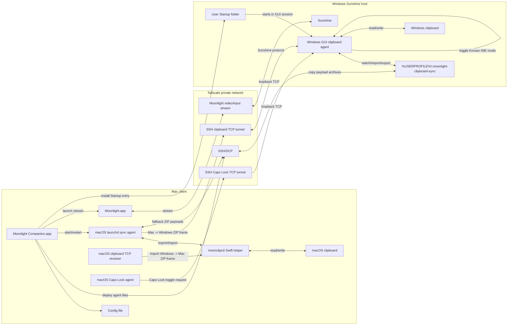
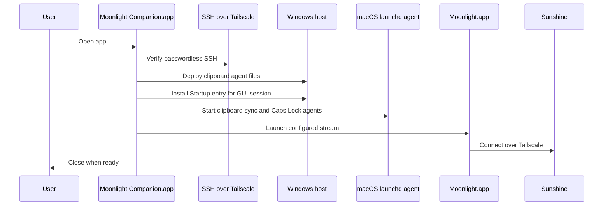
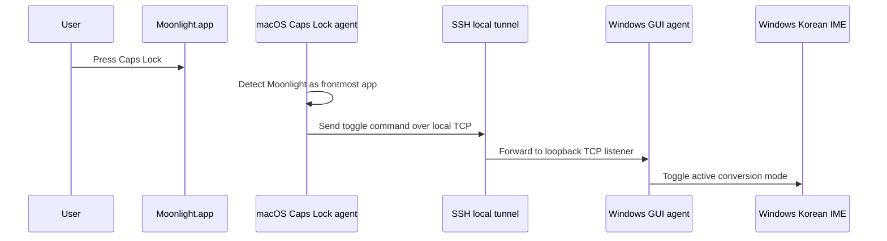

# Architecture

Moonlight Companion does not modify Moonlight or Sunshine. It runs beside them.

## Runtime Architecture



## Launch Sequence



## Clipboard Sync Flow

```mermaid
sequenceDiagram
  participant MacClip as macOS clipboard
  participant Helper as moonclipctl
  participant Sync as macOS sync loop
  participant Tunnel as SSH clipboard TCP tunnel
  participant RemoteDir as Windows payload folder
  participant Agent as Windows GUI agent
  participant Receiver as macOS TCP receiver
  participant WinClip as Windows clipboard

  MacClip->>Helper: Export current clipboard
  Helper->>Sync: manifest.json plus payload files
  Sync->>Tunnel: Send ZIP frame
  Tunnel->>Agent: Forward to loopback TCP listener
  Agent->>WinClip: Import text, image, or files

  WinClip->>Agent: Export changed clipboard
  Agent->>Tunnel: Send ZIP frame
  Tunnel->>Receiver: Forward to macOS loopback listener
  Receiver->>Helper: Import payload
  Helper->>MacClip: Write text, image, or files

  Sync-->>RemoteDir: Fallback upload if TCP send fails
  Agent-->>RemoteDir: Fallback write if TCP send fails
  Sync-->>RemoteDir: Poll fallback archive
```



## Caps Lock Han/Eng Flow



## Clipboard Payloads

Clipboard contents are exported into a payload directory:

```text
manifest.json
text.txt
image.png
files/
```

Only one primary clipboard kind is synced at a time:

- `files`
- `image`
- `text`

That priority is deliberate. File clipboard entries often also expose text paths or thumbnails, and those should not override the actual file-drop intent.

## Loop Prevention

Each payload has a deterministic `id` based on kind and content hash. Agents remember the last imported ID so the same payload is not immediately mirrored back.

## Windows Session Caveat

Windows clipboard APIs are tied to the interactive GUI session. Reading or writing the clipboard from an SSH service session is not reliable for GUI clipboard data, so the Windows agent must run in the logged-in desktop session.

macOS Caps Lock detection uses a local event tap. If macOS blocks the event tap, grant Accessibility permission to the helper process and restart Moonlight Companion. Caps Lock and clipboard TCP commands use SSH tunnels to reach loopback-only listeners in the Windows GUI session; if a tunnel disconnects, launchd closes the forwarding process and restarts it.
